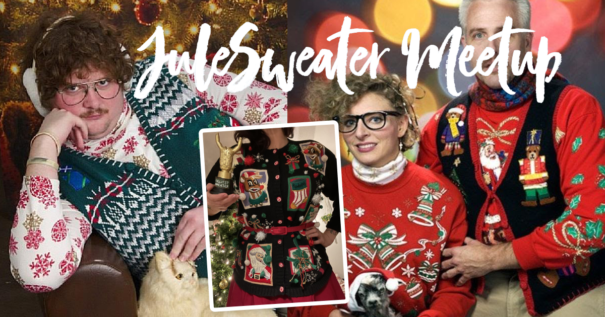

😍 it works {tm}

👉 To make the *admin* work clone the env.example to .env

🤖 go to the [admin interface admin](/admin)

💅 Themes are in /src/themes/

📜 content is in /src/content/

🎈 saga11 is build on top of [11ty](https://11ty.dev) & [NetlifyCMS](https://netlifycms.com)

🪲 bugs & comments [github](https://github.com/mortendk/saga11)

## title {.text-red-500} 
```html
<h2> code
```


